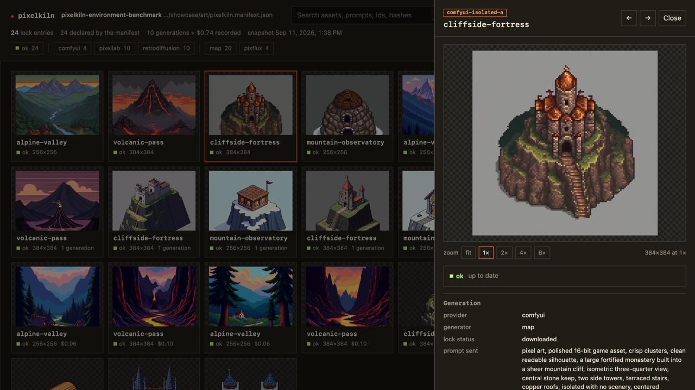
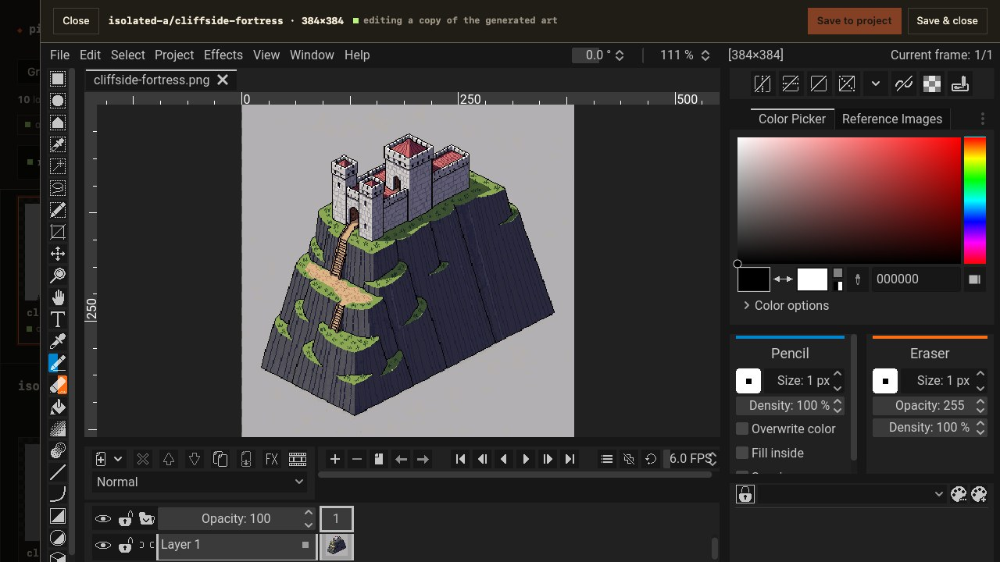

# pixelkiln


[Website](https://pixelkiln.griffen.codes) · [Documentation](https://pixelkiln.griffen.codes/docs) · [GitHub](https://github.com/gfargo/pixelkiln)

Generate pixel art from a manifest, review it locally, recover paid work, and
package the accepted files for a game engine.

PixelKiln treats generated art as build output. Declare assets once, inspect the
cost and changed work, generate only what is missing, choose candidates in a
local contact sheet, and commit the source and output hashes. No LLM chooses
what to run or which image wins. The CLI handles provider calls, polling,
hashing, downloads, and file placement.

PixelLab is the production backend. Retro Diffusion, self-hosted ComfyUI, and
Scenario are experimental. Retro Diffusion has live coverage for RD Fast and
RD Plus stills; its other paths still need paid live runs. ComfyUI has passed
local generation, candidate review, recovery, and native-grid refinement on
Apple MPS. Its tested SDXL workflow finds compositions, not finished pixel art.
Scenario has passed CU preflight, generation, human review, and durable restore
with BFL Flux 2 Dev.

Styles may use different providers with separate budget ceilings. The
[provider comparison](./PROVIDERS.md) lists the tested limits and best routes.
`FakeProvider` covers the shared contract in automated tests.

## Why PixelKiln

Image generators leave two piles behind: remote jobs that cost money and local
files that no longer explain where they came from. Prompts drift. Failed
downloads look like failed generations. Teams rerun whole sets because they
cannot tell which asset changed. PixelKiln keeps the missing record:

- a committed manifest defines assets, styles, generators, budgets, and output;
- a committed lockfile maps each style/asset to paid provider work and exact
  output hashes;
- planning distinguishes blocked, missing, stale, recoverable, in-flight, untracked, and
  manually changed files before money is spent;
- local review keeps human judgment where it matters, choosing artwork;
- content-addressed recovery prevents a transient URL failure from buying the
  same image twice;
- derived artifact bundles retain source provenance and recover across ordinary
  write failures or abrupt process termination.

Released on npm through Semantic Release and npm Trusted Publishing, with signed
provenance and no long-lived npm token.

## Capabilities

| Workflow | What PixelKiln provides |
|---|---|
| Plan and budget | Offline manifest/lock/disk diff, provider-grouped estimates, keyed mixed-provider budget ceilings, JSON/CI gate. |
| Generate and review | Resumable submit/poll/pick/fetch pipeline, exact next-step hints, candidate or atomic frame-set review, and a provenance gallery that can edit intent, generate under a budget, and compare records. |
| Hand edits | Touch-ups in your own editor or a pinned in-browser Pixelorama, kept beside the generated art with the generation still the record; frame and tile sets member by member. |
| Controlled inputs | Hashed image-to-image/inpaint lineage, fail-closed parent approval, source-versus-candidate review, and content-addressed per-asset ComfyUI bindings. |
| Characters | A base in 4 or 8 directions from a prompt or your own sprite (four PixelLab engines), poses and loops as dependent assets generated in waves, free mirrored directions, account adoption, and SpriteFrames export. |
| Existing-art onboarding | Manifest scaffolding, exact-hash account adoption, and prompt recovery. |
| Recovery | Safe stale-output replacement, validated caches, durable references, resumable paid jobs, and per-asset generation history with free restores. |
| Shared-account safety | Cross-project claim files or a registered workspace catalog, sibling-style exclusion, reviewed salvage, keep/discard tags, separate confirmed purge. |
| Quality control | Palette snapping on download, native grid recovery, named approval, regression baselines, and fail-closed packaging. |
| Sprite packaging | Deterministic RGBA packing, stable-cell mounting, explicit external input lists, structural output roles. |
| Engine export | Aseprite sheet JSON and Godot SpriteFrames from `pack`; Tiled Wang sets and Godot terrain sets from `export`. |
| Artifact integrity | Portable source/output hashes, canonical fingerprints, manual-edit protection, transactional promotion, crash journal recovery. |
| Library/extension | Public TypeScript primitives, provider capability interface, and deterministic `FakeProvider`. |

### Local human review

`pixelkiln pick` opens a local candidate sheet with native aspect ratios and
crisp small sprites. No model chooses artwork for you.


Left/Right inspects alternatives, Enter or 1–9 selects, 0 leaves a row
unresolved, and closing without **Apply selections** applies nothing
([CLI reference](docs/CLI.md#pick)). [`pixelkiln gallery`](docs/CLI.md#gallery)
is its companion: every generation at integer zoom with its prompt, cost, hashes,
lineage, and quality record, side-by-side comparison, and a `--workspace` view
across projects. `--edit` changes prompts, sizes, tags, and style fields (with the
blast radius shown first) and adds assets; `--budget` generates, regenerates, and
reviews from the page under that ceiling.



Hand edits live beside the art, not in place of the record. [`pixelkiln edit`](docs/CLI.md#edit)
opens a copy in your own editor; with `--edit` the gallery does the same, or opens
it in a pinned, hash-verified [Pixelorama](docs/CLI.md#tools) build right in the page
and saves it back with its layers kept, one file per member for frame and tile sets.



## Install

Requires Node.js 22 or newer; use the latest Node.js 24 LTS for development.

```bash
npm install --save-dev pixelkiln
npx pixelkiln --help
```

Both `import("pixelkiln")` and `require("pixelkiln")` work; contributors can run
`npm run pixelkiln -- …` from a checkout to execute the TypeScript source.

## Five-minute start

Copy the minimal example into a project and edit its output path and prompts:

```bash
cp examples/minimal/pixelkiln.manifest.json ../my-game/pixelkiln.manifest.json
cd ../my-game
```

Put a hosted provider's credential in `.env.local` beside the manifest:

```dotenv
# PixelLab (the default provider)
PIXELLAB_API_KEY=...
# Or Retro Diffusion when `provider` is `retrodiffusion`
RD_API_KEY=...
# Scenario needs both values when `provider` is `scenario`
SCENARIO_SDK_API_KEY=...
SCENARIO_SDK_API_SECRET=...
# Self-hosted ComfyUI needs no key; override its local URL only when needed
COMFYUI_BASE_URL=http://127.0.0.1:8188
```

Validate locally, inspect exact work/cost, then generate with a hard ceiling:

```bash
npx pixelkiln doctor --dry-run
npx pixelkiln plan
npx pixelkiln gen --budget 120
```

`gen` submits, polls, opens the candidate-review sheet when necessary,
downloads validated output, populates the recovery cache, and updates
`pixelkiln.lock.json`. Commit the manifest, lockfile, generated art, and any
derived artifact companions. Do not commit credentials or `.pixelkiln/`.

For an existing art tree:

```bash
pixelkiln init --from assets/sprites --exclude characters,gifs --generator map
pixelkiln adopt --write-prompts
pixelkiln plan
```

See [Getting started](./docs/GETTING_STARTED.md) for new and existing projects.
Use [Set up PixelLab](./docs/PIXELLAB.md),
[Set up Retro Diffusion](./docs/RETRO_DIFFUSION.md),
[Set up ComfyUI](./docs/COMFYUI.md), or
[Set up Scenario](./docs/SCENARIO.md) for provider-specific configuration,
manifest examples, and current limits. See [Mixed-provider projects](./docs/MIXED_PROVIDERS.md)
when styles in one manifest need different backends.

## Agent skill

Install the official PixelKiln skill so Codex, Claude Code, Cursor, and other
compatible agents know the safe plan → budget → generate → review → recover
workflow:

```bash
npx skills add gfargo/pixelkiln@pixelkiln
```

The skill guides an agent around PixelKiln; it does not replace a generation
provider. PixelLab's MCP server is a complementary direct-generation surface,
while PixelKiln remains the project state, budget, provenance, review, and
packaging layer.

## Manifest

```jsonc
{
  "$schema": "./node_modules/pixelkiln/schema/manifest.schema.json",
  "name": "my-game",
  "provider": "pixellab",
  "styles": {
    "base": {
      "generator": "map",
      "promptPrefix": "pixel-art game prop",
      "promptSuffix": "isolated, transparent background",
      "outDir": "assets/generated/base",
      "tags": ["my-game"]
    }
  },
  "assets": {
    "anvil": { "prompt": "a compact blacksmith anvil" },
    "hammer": { "prompt": "a worn forging hammer" }
  }
}
```

Styles are namespaces. A variant can `extend` a base style while keeping its own
output directory, so later parent fixes reach every child without copied config.
Each style re-derives the same asset ids into separate lock keys. Generator
choice, reference-image bytes, dimensions, palette, seed, and
prompt settings participate in deterministic spec identity. A manifest may
select another provider and pass namespaced `providerOptions`; see
[Set up PixelLab](./docs/PIXELLAB.md),
[Set up Retro Diffusion](./docs/RETRO_DIFFUSION.md),
[Set up ComfyUI](./docs/COMFYUI.md), and
[Set up Scenario](./docs/SCENARIO.md). The
[provider comparison](./PROVIDERS.md) covers costs,
current confidence, and limitations. ComfyUI works best as a composition tool:
start with 48–128px native components and build larger scenes from accepted
parts. Supported still styles and ComfyUI frame sets can declare a `quality`
profile for grid recovery, a closed palette, measurable checks, and named human approval. `plan --check`,
`pack`, and `mount` then fail closed when that derived output is missing or
stale. Changing the profile never schedules another provider generation.

Versioned recipes capture tested workflows, model hashes, license links, and
manifest-ready styles with quality boundaries. Start with `pixelkiln recipe install comfyui/pixel-art-xl-environment@1.0.0`.
Recipes install no models and make no provider calls. See [Versioned recipes](./docs/RECIPES.md).

The schema rejects unknown fields and invalid generator combinations before
planning. See the [Manifest reference](./docs/MANIFEST.md).

## Everyday workflow

```bash
# Free: validate and inspect drift, recovery, and estimated spend.
pixelkiln doctor --dry-run
pixelkiln plan

# Generate only an intended slice with a provider-unit ceiling.
pixelkiln gen --style base --only anvil,hammer --budget 80

# Repair paid output without regenerating; pull edits made in PixelLab's editor.
pixelkiln restore
pixelkiln fetch --refresh

# Touch one sprite up by hand, in your editor or the gallery's.
pixelkiln edit --only anvil --style base
pixelkiln gallery --edit

# Optional local gates.
pixelkiln audit --check --max-distance 35 --min-transparency 0.1

# Build and verify the quality output declared by style.quality.
pixelkiln refine --style base
pixelkiln refine approve --from assets/final/anvil.pixelkiln.json --reviewer "Your Name"
pixelkiln refine check --style base
```

Repeated `--style`, `--only`, `--claims`, and `--output-role` filters accumulate;
commas work too. Unknown flags are hard errors, so a typo cannot widen paid work.

## Choose the right generator

Measured PixelLab economics vary by 40×:

| Need | Generator | Measured cost |
|---|---|---:|
| Standalone arbitrary-size prop/icon | `map` (default) | 1 generation |
| Exact closed palette | `pixflux` | 1 generation |
| Candidate variety/reference anchoring/future animation | `1dir` | 20–40 generations |
| Independent or connectable ground tiles | `tiles` | 20–40 generations |
| A character in 4 or 8 directions, its poses, its loops | `character` | 1 per base, 20–40 per pose, 1 per template loop per direction; a `mirror` of a loop is free |

Start with the required capability, not the most expensive endpoint. Forty
`map` re-rolls cost the same as one 64×64 `1dir` call; conversely, `map` cannot
replace a hard palette or reference-image constraint. See
[Generator selection](./docs/GENERATORS.md) and the
[measured endpoint reference](./docs/ENDPOINTS.md).

Generator names describe PixelKiln workflows; their exact capabilities and
prices depend on the selected provider. Retro Diffusion also supports the
provider-specific `animation` generator. ComfyUI supports `map` plus atomic
still-image `frames` through an operator-supplied workflow. Scenario supports `map`
with a required offline CU ceiling and a live quote before each paid call.
Compare the adapters in the [provider comparison](./PROVIDERS.md).

## Derived artifacts

```bash
# Deterministic sheet + atlas + provenance.
pixelkiln pack --style base
# Stable declared cells in an existing sheet.
pixelkiln mount --style ground
# Structural atlas + engine metadata + provenance.
pixelkiln export --style ground --only terrain --format tiled
```

Pack, mount, and export write managed bundles. When a style has a quality
profile they consume only its current approved PNGs; a hand edit stands in for
its generation. Unowned output is adopted only when byte-identical; manual edits
stop the write unless `--force` takes ownership. Changing members stage before
promotion, ordinary failures roll back, and abrupt termination leaves a journal
the next invocation finishes. See [Derived artifacts](./docs/ARTIFACTS.md) and
[Tiles and engine exports](./docs/TILES.md).

## Recovery and shared accounts

```bash
# Reconcile existing files with account objects.
pixelkiln adopt --write-prompts

# Review paid account objects no known project claims.
pixelkiln salvage --claims ../other-game/pixelkiln.lock.json --dry-run
pixelkiln salvage --claims ../other-game/pixelkiln.lock.json

# Deletion is deliberately separate and confirmed.
pixelkiln purge --dry-run
pixelkiln purge
```

Salvage imports, keeps, or tags discard; it never deletes. On shared accounts,
pass every other project lockfile via `--claims`, or register siblings once in
a workspace catalog and pass `--workspace`, so shipped art cannot appear
unowned:

```bash
pixelkiln workspace add ../other-game/pixelkiln.manifest.json
pixelkiln workspace status
pixelkiln salvage --workspace pixelkiln.workspace.json
```

A registered project's missing or unreadable lockfile is a hard error for
`workspace claims` and `salvage --workspace`; missing claims are never skipped.
Purge only targets objects already tagged discard and asks first.
See [Recovery and account safety](./docs/RECOVERY.md).

## Automation

```bash
pixelkiln doctor --dry-run --json
pixelkiln plan --json --check
pixelkiln audit --json --check --max-distance 35 --max-colors 128
pixelkiln cache --check
```

Pipeline stages exit nonzero after partial failures or timeouts. JSON modes
separate machine output from human diagnostics where necessary. Generation
should remain an explicit budgeted action; CI should prove committed state and
artifacts agree rather than regenerate them. See
[Quality and automation gates](./docs/QUALITY.md).

## TypeScript library

```ts
import { openProject } from "pixelkiln"

const project = await openProject("pixelkiln.manifest.json")
const plan = await project.plan()
console.log(plan.groups, plan.actionable.length)
```

`openProject` reads the env files beside the manifest, loads it, resolves
every spec, and loads the lockfile with its paths canonicalised for this
checkout. `project.specs`, `project.lock`, and `project.lockPath` are what the
lower-level `submit`, `poll`, and `fetchAssets` calls take.

The package also exports audit and image-regression gates, quality-profile
inspection and refinement, revision-readiness checks, lock/output helpers, the
gallery snapshot and server, hand edits and the editor install, provider contracts,
sprite packing/mounting, tile exporters, managed artifact writes, and provenance
verification. See [Library API](./docs/LIBRARY.md).

## Documentation

| Guide | Covers |
|---|---|
| [Documentation index](./docs/README.md) | All user, workflow, reference, and architecture guides. |
| [Getting started](./docs/GETTING_STARTED.md) | First project, existing-art onboarding, everyday workflow, and what to commit. |
| [Set up PixelLab](./docs/PIXELLAB.md) | Production-provider credentials, manifest, generators, and account workflows. |
| [Set up Retro Diffusion](./docs/RETRO_DIFFUSION.md) | Experimental-provider credentials, styles, formats, cost checks, and limits. |
| [Set up ComfyUI](./docs/COMFYUI.md) | Self-hosted stills, revisions, ordered frame sets, per-asset inputs, and quality limits. |
| [Set up Scenario](./docs/SCENARIO.md) | Experimental hosted models, two-part credentials, CU preflight, review, and durable downloads. |
| [Versioned recipes](./docs/RECIPES.md) | Pinned workflow packs, model hashes, manifest templates, and quality contracts. |
| [Controlled revisions](./docs/REVISIONS.md) | Image-to-image/inpaint parents, masks, fail-closed readiness, provenance, and ComfyUI bindings. |
| [CLI reference](./docs/CLI.md) | Every command, flag, JSON mode, and exit contract. |
| [Manifest reference](./docs/MANIFEST.md) | Style/asset fields, quality profiles, and generator constraints. |
| [Mixed-provider projects](./docs/MIXED_PROVIDERS.md) | Per-style routing, provider-keyed budgets, recovery, and account commands. |
| [Agent workflows](./docs/AGENTS.md) | Official skill install, operating model, and provider-aware safety. |
| [Generators](./docs/GENERATORS.md) | Capability choice, measured costs, palettes, style references, and tiles. |
| [Environment provider benchmark](./docs/PROVIDER_BENCHMARK.md) | Thirty provider outputs plus native-grid and final-palette results comparing large scenes, transparency, palette size, and file readiness. |
| [Derived artifacts](./docs/ARTIFACTS.md) | Refine, pack, mount, export, provenance, ownership, transactions, and recovery. |
| [Recovery](./docs/RECOVERY.md) | Restore, caches, adopt, salvage, claims, and purge safety. |
| [Quality gates](./docs/QUALITY.md) | Image baselines, plan, doctor, refine, audit, cache, human approval, JSON, and CI. |
| [Architecture](./docs/ARCHITECTURE.md) | State model, lockfile, providers, concurrency, and output identity. |
| [Library API](./docs/LIBRARY.md) | Public TypeScript contracts and examples. |
| [Tiles](./docs/TILES.md) | Structural outputs and generic/Tiled/Godot formats. |
| [Endpoint research](./docs/ENDPOINTS.md) | Measured PixelLab API behavior and recipes. |
| [Provider comparison](./PROVIDERS.md) | Provider selection, costs, supported workflows, confidence, and limitations. |

The [public documentation site](https://pixelkiln.griffen.codes/docs) is built from
these Markdown files by [`website/`](./website/README.md), so the site and the
package share one source. Policies: [Contributing](./CONTRIBUTING.md),
[Security](./SECURITY.md), [provider comparison](./PROVIDERS.md).

## Scope

PixelLab's portrait and outfit tools, cross-project cache reuse, and
`workspace find` are not implemented; see the open [issues](https://github.com/gfargo/pixelkiln/issues).

## License

[MIT](./LICENSE)
