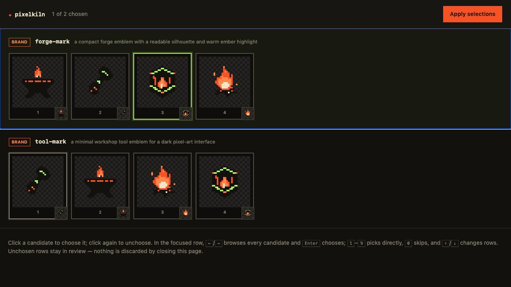

# pixelkiln


[Website](https://pixelkiln.griffen.codes) ·
[Documentation](https://pixelkiln.griffen.codes/docs) ·
[GitHub](https://github.com/gfargo/pixelkiln)

Manifest-driven pixel-art generation, review, recovery, quality control, and
game-ready asset packaging.

PixelKiln treats generated art like a build pipeline: declare assets once,
preview cost and drift, generate only the missing work, review candidates in a
local contact sheet, and commit exact provenance beside the files. No LLM is in
the orchestration loop; provider calls, polling, hashing, downloads, and filing
are deterministic software mechanics.

The orchestration layer is provider-neutral. PixelLab is the production,
live-tested backend. An experimental Retro Diffusion adapter supports native
pixel-art stills, candidate batches, tileset sheets, animated GIFs, and PNG
spritesheets. Authenticated RD Fast and RD Plus single-candidate still paths
have passed from quote through validated output and recovery. Multi-candidate,
tileset, GIF, and spritesheet live runs remain. An experimental ComfyUI adapter
runs committed API-format still-image workflows on a self-hosted server. Its
core-node smoke project has passed live generation, candidate queueing, and
cache-only recovery on Apple MPS. An SDXL plus Pixel Art XL workflow also has
four baseline samples and four refined transparency and palette samples. See
[provider comparison](./PROVIDERS.md) for the trade-offs, including large
environment and building workflows.
`FakeProvider` exercises the same contract deterministically in tests.

> **Release status:** PixelKiln is published on npm. Merges to `main` use
> Semantic Release and npm Trusted Publishing, with signed provenance and no
> long-lived npm publishing token.

## Why PixelKiln

A typical image-generation account becomes two unrelated piles: remote objects
that cost money and local files with no durable explanation of where they came
from. Handwritten prompts drift, failed downloads look like failed generations,
and regenerating a whole set is easier than determining what is actually stale.

PixelKiln supplies the missing project model:

- a committed manifest defines assets, styles, generators, budgets, and output;
- a committed lockfile maps each style/asset to paid provider work and exact
  output hashes;
- planning distinguishes missing, stale, recoverable, in-flight, untracked, and
  manually changed files before money is spent;
- local review keeps human judgment where it matters, choosing artwork;
- content-addressed recovery prevents a transient URL failure from buying the
  same image twice;
- derived artifact bundles retain source provenance and recover across ordinary
  write failures or abrupt process termination.

## Capabilities

| Workflow | What PixelKiln provides |
|---|---|
| Plan and budget | Offline manifest/lock/disk diff, provider-unit estimates, hard `--budget` ceiling, JSON/CI gate. |
| Generate and review | Resumable submit/poll/pick/fetch pipeline with a fast local candidate sheet. |
| Existing-art onboarding | Manifest scaffolding, exact-hash account adoption, and prompt recovery. |
| Recovery | Validated local content cache, provider URL restore, account object-hash cache, and resumable jobs. |
| Shared-account safety | Cross-project claim files or a registered workspace catalog, sibling-style exclusion, reviewed salvage, keep/discard tags, separate confirmed purge. |
| Quality control | Palette distance, transparency, color-count, relative outlier, cache-integrity, and doctor gates. |
| Sprite packaging | Deterministic RGBA packing, stable-cell mounting, explicit external input lists, structural output roles. |
| Engine export | Lossless generic tile contract, Tiled Wang sets, and Godot 4 terrain sets. |
| Artifact integrity | Portable source/output hashes, canonical fingerprints, manual-edit protection, transactional promotion, crash journal recovery. |
| Library/extension | Public TypeScript primitives, provider capability interface, and deterministic `FakeProvider`. |

### Human review, kept local

`pixelkiln pick` opens an actual local candidate sheet; the orchestration layer
never asks a model to choose artwork for you.



Use Left/Right to inspect alternatives, Enter or 1–9 to select, and 0 to leave
a row unresolved. Nothing is applied when the window is closed without using
**Apply selections**. See the [CLI reference](docs/CLI.md#pick) for the complete
review workflow.

## Install

Requires Node.js 20 or newer.

```bash
npm install --save-dev pixelkiln
npx pixelkiln --help
```

For library use, both `import("pixelkiln")` and `require("pixelkiln")` are
supported. Contributors can still run `npm run pixelkiln -- …` from a checkout
to execute the TypeScript source directly.

## Five-minute start

Copy the minimal example into a project and edit its output path and prompts:

```bash
cp examples/minimal/pixelkiln.manifest.json ../my-game/pixelkiln.manifest.json
cd ../my-game
```

Put a hosted provider's credential in `.env.local` beside the manifest:

```dotenv
# PixelLab (the default provider)
PIXELLAB_API_KEY=...

# Or Retro Diffusion when `provider` is `retrodiffusion`
RD_API_KEY=...

# Self-hosted ComfyUI needs no key; override its local URL only when needed
COMFYUI_BASE_URL=http://127.0.0.1:8188
```

Validate locally, inspect exact work/cost, then generate with a hard ceiling:

```bash
npx pixelkiln doctor --dry-run
npx pixelkiln plan
npx pixelkiln gen --budget 120
```

`gen` submits, polls, opens the candidate-review sheet when necessary,
downloads validated output, populates the recovery cache, and updates
`pixelkiln.lock.json`. Commit the manifest, lockfile, generated art, and any
derived artifact companions. Do not commit credentials or `.pixelkiln/`.

For an existing art tree:

```bash
pixelkiln init --from assets/sprites --exclude characters,gifs --generator map
pixelkiln adopt --write-prompts
pixelkiln plan
```

See [Getting started](./docs/GETTING_STARTED.md) for new and existing projects.
Use [Set up PixelLab](./docs/PIXELLAB.md),
[Set up Retro Diffusion](./docs/RETRO_DIFFUSION.md), or
[Set up ComfyUI](./docs/COMFYUI.md) for provider-specific configuration,
manifest examples, and current limits.

## Agent skill

Install the official PixelKiln skill so Codex, Claude Code, Cursor, and other
compatible agents know the safe plan → budget → generate → review → recover
workflow:

```bash
npx skills add gfargo/pixelkiln@pixelkiln
```

The skill guides an agent around PixelKiln; it does not replace a generation
provider. PixelLab's MCP server is a complementary direct-generation surface,
while PixelKiln remains the project state, budget, provenance, review, and
packaging layer.

## Manifest

```jsonc
{
  "$schema": "./node_modules/pixelkiln/schema/manifest.schema.json",
  "name": "my-game",
  "provider": "pixellab",
  "styles": {
    "base": {
      "generator": "map",
      "promptPrefix": "Pixel-art game prop: ",
      "promptSuffix": ", isolated, transparent background",
      "outDir": "assets/generated/base",
      "tags": ["my-game"]
    }
  },
  "assets": {
    "anvil": { "prompt": "a compact blacksmith anvil" },
    "hammer": { "prompt": "a worn forging hammer" }
  }
}
```

Styles are namespaces. Adding a second style re-derives the same asset ids into
a separate output directory and separate lock keys without clobbering the first
set. Generator choice, reference-image bytes, dimensions, palette, seed, and
prompt settings participate in deterministic spec identity. A manifest may
select another provider and pass namespaced `providerOptions`; see
[Set up PixelLab](./docs/PIXELLAB.md),
[Set up Retro Diffusion](./docs/RETRO_DIFFUSION.md), and
[Set up ComfyUI](./docs/COMFYUI.md). The
[provider comparison](./PROVIDERS.md) covers costs,
current confidence, and limitations. The committed ComfyUI projects now include
transparent cutouts, palette-controlled backgrounds, wide environment canvases,
and native-grid recovery for model output that only looks like pixel art. The
ComfyUI guidance is quality-first: start with 48–128px native components,
require a human cluster-and-silhouette review, and compose larger scenes from
accepted parts instead of chasing a larger raster.

The schema rejects unknown fields and invalid generator combinations before
planning. See the [Manifest reference](./docs/MANIFEST.md).

## Everyday workflow

```bash
# Free: validate and inspect drift, recovery, and estimated spend.
pixelkiln doctor --dry-run
pixelkiln plan

# Generate only an intended slice with a provider-unit ceiling.
pixelkiln gen --style base --only anvil,hammer --budget 80

# Repair paid output without regenerating.
pixelkiln restore

# Optional local gates.
pixelkiln audit --check --max-distance 35 --min-transparency 0.1
pixelkiln cache --check
```

Repeated `--style`, `--only`, `--claims`, and `--output-role` filters
accumulate; comma-separated values also work. Unknown flags are hard errors, so
a typo cannot silently widen paid work.

## Choose the right generator

Measured PixelLab economics vary by 40×:

| Need | Generator | Measured cost |
|---|---|---:|
| Standalone arbitrary-size prop/icon | `map` (default) | 1 generation |
| Exact closed palette | `pixflux` | 1 generation |
| Candidate variety/reference anchoring/future animation | `1dir` | 20–40 generations |
| Independent or connectable ground tiles | `tiles` | 20–40 generations |

Start with the required capability, not the most expensive endpoint. Forty
`map` re-rolls cost the same as one 64×64 `1dir` call; conversely, `map` cannot
replace a hard palette or reference-image constraint. See
[Generator selection](./docs/GENERATORS.md) and the
[measured endpoint reference](./docs/ENDPOINTS.md).

Generator names describe PixelKiln workflows; their exact capabilities and
prices depend on the selected provider. Retro Diffusion also supports the
provider-specific `animation` generator. ComfyUI currently supports `map`
through an operator-supplied workflow. Compare the adapters in the
[provider comparison](./PROVIDERS.md).

## Derived artifacts

```bash
# Deterministic sheet + atlas + provenance.
pixelkiln pack --style base

# Stable declared cells in an existing sheet.
pixelkiln mount --style ground

# Structural atlas + engine metadata + provenance.
pixelkiln export --style ground --only terrain --format tiled
```

Pack, mount, and export write managed bundles. A `.pixelkiln.json` companion
records portable source paths/hashes, layout/export options, output hashes, and
a canonical fingerprint. Existing unowned output is adopted only when already
byte-identical; manual edits stop the whole write unless `--force` explicitly
takes ownership.

All changing members stage before promotion. Ordinary failures roll back.
Abrupt termination leaves a validated transaction journal: the next invocation
restores an incomplete old bundle or finishes cleanup for a committed new one.
See [Derived artifacts](./docs/ARTIFACTS.md) and
[Tiles and engine exports](./docs/TILES.md).

## Recovery and shared accounts

```bash
# Reconcile existing files with account objects.
pixelkiln adopt --write-prompts

# Review paid account objects no known project claims.
pixelkiln salvage --claims ../other-game/pixelkiln.lock.json --dry-run
pixelkiln salvage --claims ../other-game/pixelkiln.lock.json

# Deletion is deliberately separate and confirmed.
pixelkiln purge --dry-run
pixelkiln purge
```

Salvage imports, keeps, or tags discard; it never deletes. On shared accounts,
pass every other project lockfile via `--claims`, or register siblings once in
a workspace catalog and pass `--workspace`, so shipped art cannot appear
unowned:

```bash
pixelkiln workspace add ../other-game/pixelkiln.manifest.json
pixelkiln workspace status
pixelkiln salvage --workspace pixelkiln.workspace.json
```

A registered project's missing or unreadable lockfile is a hard error for
`workspace claims` and `salvage --workspace`. Missing claims are never skipped.
Purge only targets objects already tagged discard and requires an explicit
confirmation.
See [Recovery and account safety](./docs/RECOVERY.md).

## Automation

```bash
pixelkiln doctor --dry-run --json
pixelkiln plan --json --check
pixelkiln audit --json --check --max-distance 35 --max-colors 128
pixelkiln cache --check
```

Pipeline stages exit nonzero after partial failures or timeouts. JSON modes
separate machine output from human diagnostics where necessary. Generation
should remain an explicit budgeted action; CI should prove committed state and
artifacts agree rather than regenerate them. See
[Quality and automation gates](./docs/QUALITY.md).

## TypeScript library

```ts
import {
  buildPlan,
  loadLock,
  loadManifest,
  PixelLabProvider,
  resolveSpecs,
} from "pixelkiln"

const loaded = await loadManifest("pixelkiln.manifest.json")
const provider = PixelLabProvider.forOffline()
const specs = await resolveSpecs(loaded, { provider })
const plan = await buildPlan(specs, await loadLock("pixelkiln.lock.json"))

console.log(plan.cost, plan.costUnit, plan.actionable.length)
```

The package also exports audit gates, lock/output helpers, provider contracts,
pipeline stages, sprite packing/mounting, tile exporters, managed artifact
writes, and offline provenance verification. See [Library API](./docs/LIBRARY.md).

## Documentation

| Guide | Covers |
|---|---|
| [Documentation index](./docs/README.md) | All user, workflow, reference, and architecture guides. |
| [Getting started](./docs/GETTING_STARTED.md) | First project, existing-art onboarding, everyday workflow, and what to commit. |
| [Set up PixelLab](./docs/PIXELLAB.md) | Production-provider credentials, manifest, generators, and account workflows. |
| [Set up Retro Diffusion](./docs/RETRO_DIFFUSION.md) | Experimental-provider credentials, styles, formats, cost checks, and limits. |
| [Set up ComfyUI](./docs/COMFYUI.md) | Experimental self-hosted server, workflow bindings, local cost semantics, and limits. |
| [CLI reference](./docs/CLI.md) | Every command, flag, JSON mode, and exit contract. |
| [Manifest reference](./docs/MANIFEST.md) | Every style/asset field and generator constraint. |
| [Agent workflows](./docs/AGENTS.md) | Official skill install, operating model, and provider-aware safety. |
| [Generators](./docs/GENERATORS.md) | Capability choice, measured costs, palettes, style references, and tiles. |
| [Environment provider benchmark](./docs/PROVIDER_BENCHMARK.md) | Thirty provider outputs plus three deterministic native-grid results comparing large scenes, transparency, palette size, and file readiness. |
| [Derived artifacts](./docs/ARTIFACTS.md) | Pack, mount, export, provenance, ownership, transactions, and recovery. |
| [Recovery](./docs/RECOVERY.md) | Restore, caches, adopt, salvage, claims, and purge safety. |
| [Quality gates](./docs/QUALITY.md) | Plan, doctor, audit, cache, JSON, and CI. |
| [Architecture](./docs/ARCHITECTURE.md) | State model, lockfile, providers, concurrency, and output identity. |
| [Library API](./docs/LIBRARY.md) | Public TypeScript contracts and examples. |
| [Tiles](./docs/TILES.md) | Structural outputs and generic/Tiled/Godot formats. |
| [Endpoint research](./docs/ENDPOINTS.md) | Measured PixelLab API behavior and recipes. |
| [Provider comparison](./PROVIDERS.md) | Provider selection, costs, supported workflows, confidence, and limitations. |

The [public documentation site](https://pixelkiln.griffen.codes/docs) is built by
the application in [`website/`](./website/README.md). It reads these Markdown
files directly at build time, so the website and published package share one
documentation source.

Project policies: [Contributing](./CONTRIBUTING.md),
[Security](./SECURITY.md), and [provider comparison](./PROVIDERS.md).

## Scope

Animated eight-direction characters and their ZIP/engine-resource export are
not currently implemented. Cross-project content-cache reuse and
`workspace find <hash|asset-id>` are deferred beyond the current read-only
workspace catalog. See the open
[roadmap issues](https://github.com/gfargo/pixelkiln/issues) for additional
provider adapters and this remaining workspace work.

## License

[MIT](./LICENSE)
