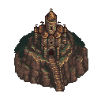
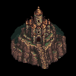
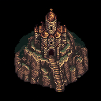

# ComfyUI controlled-revision smoke

This project checks the first real image-to-image path through PixelKiln and a
local ComfyUI server. It starts from the committed 128×128 refined fortress,
uses the bundled `comfyui/pixel-art-xl-img2img@1.0.0` workflow at strengths
`0.25`, `0.4`, and `0.6`, and asks for a winter treatment while preserving the
structure.

The smoke answers narrow engineering questions: can PixelKiln hash and upload
the source, bind the workflow, queue it, download the exact output, and retain
revision/workflow provenance? One result cannot establish artistic reliability.
The output remains a composition candidate until it passes native-grid, palette,
and human 1× review.

```bash
pixelkiln recipe verify ../../../recipes/comfyui/pixel-art-xl-img2img/1.0.0 \
  --model-root "/path/to/ComfyUI/models"
pixelkiln doctor --manifest pixelkiln.manifest.json
pixelkiln plan --manifest pixelkiln.manifest.json
pixelkiln gen --manifest pixelkiln.manifest.json --budget comfyui=0 --no-open
```

The source is kept outside this folder to avoid duplicating benchmark bytes.
All paths still resolve from this manifest, independent of the current shell
directory.

## Results

| Source | Strength 0.25 | Strength 0.4 | Strength 0.6 |
|---|---|---|---|
|  |  |  |  |

| File | Visible RGB colors | Transparent pixels | SHA-256 |
|---|---:|---:|---|
| Source | 15 | 61.60% | `35748d35ea4df5cb3ed2af60d7833c7cf8c7c769bf343d599fba57653eddd200` |
| Strength 0.25 | 4,208 | 0% | `af8897aa735285f611a3500a1d5775674193e63a5593a1c8e24d13998f367f29` |
| Strength 0.4 | 4,412 | 0% | `ab8f7472669709a5a36cd2cc4ca2c4ab5cecc8634c7195d4a0aa19ceb810b16e` |
| Strength 0.6 | 5,224 | 0% | `e13b7452105d2a19dae65cac88c8f694b3a2222cc9a696de24ced36ad159adb3` |

All three submissions completed and the final plan reports four current assets.
The source hash is identical in every child lock record. Changing strength and
prompt creates separate spec identities and outputs.

The visual result is weaker than the transport result. Strengths 0.25 and 0.4
closely preserve the fortress, but the requested snow is barely visible.
Strength 0.6 changes more roof and tower detail without producing a clear
winter treatment. Every result loses the source alpha and expands from 15
colors into thousands of RGB colors. Do not use this core graph as an automatic
asset improver. It needs a better conditioning/prompt strategy, alpha recovery,
native-grid reconstruction, palette enforcement, and a broader two-subject A/B
before recommendation.
