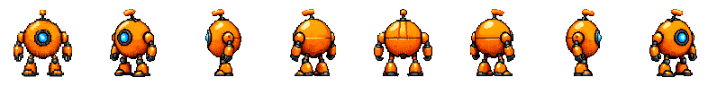
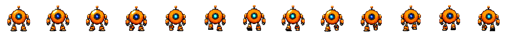

# Characters

A `character` style holds one PixelLab character as three kinds of asset: a
base drawn facing 4 or 8 directions, states that apply a pose or an outfit
to every direction at once, and loops, one direction each. Each is an asset
with its own lockfile record and files, so `plan` prices the cast, one `gen`
runs it in waves, and `pack` writes every direction and loop for the engine.
This page is the reference for the manifest shapes; the [manifest
reference](./MANIFEST.md) covers the fields every asset shares.

A prop, creature, or vehicle with no skeleton to fit — a floating rune, a
treasure chest, a turret — wants `objectPro` instead: the same base/state/
animation shapes and `asset.state`/`asset.animation` authoring described
here, minus everything template/skeleton-specific. See
[GENERATORS.md](./GENERATORS.md#objectpro).

## The three shapes

A cast in full, with a base, a state, and two loops. This is the robot on
the [site](https://pixelkiln.griffen.codes/#characters), drawn the way the
example says:



```json
{
  "styles": {
    "cast": {
      "generator": "character",
      "outDir": "art/characters",
      "view": "side",
      "size": 96,
      "mode": "pro-flash",
      "template": "custom"
    }
  },
  "assets": {
    "bot": {
      "prompt": "small round orange robot with one blue eye, short jointed legs"
    },
    "bot.dented": {
      "prompt": "shell dented and scuffed, one arm hanging loose, eye dim",
      "state": { "of": "bot", "paletteFromReference": true }
    },
    "bot.walk": {
      "prompt": "walking forward in place, short legs stepping, body bobbing slightly",
      "animation": { "of": "bot", "direction": "south", "frames": 12, "fps": 12 }
    },
    "bot.jump": {
      "prompt": "crouching down, springing up into the air with legs tucked, landing with a small bounce",
      "animation": { "of": "bot", "direction": "south", "frames": 8, "fps": 12 }
    }
  }
}
```



The robot is round, so its style names the `custom` skeleton template and
its loops come from a sentence each on the v3 engine; a biped on the
`mannequin` template could take a template loop instead
(`"animation": { "of": "bot", "template": "walk" }`), one generation per
direction. See [Animations](#animations).

### The base

A base is a prompt, wrapped in the style's prefix and suffix like any other
asset, that PixelLab draws facing 4 or 8 directions. `mode` picks the
engine: `standard` (1 generation, the skeleton template, `outline`,
`shading`, and `detail` as soft guidance, and `palette` sent as a colour
reference), `v3` (2 to 9 by size, the highest quality, up to 256px),
`pro` (20 to 40 by size), or `pro-flash` (6 to 17 by size: PixelLab's
newest image model draws the south sprite and v3 rotates it; sizes are
multiples of 4 up to 256, `template` may be `custom`, and a `reference`
pays for the rotations only, 1 at 64px). `size` is the character's size;
`view` is `low top-down` (the default), `high top-down`, or `side`;
`template` picks the body. Each direction lands as
`<asset>-<direction>.png`, south first.
Standard mode draws on a canvas 28px larger than `size`, 14px of room on
each side for animation (a 64px character comes back as 92px files, a
104px one as 132px); the lock records the size asked for, and the files
are what PixelLab drew.

### Proportions, guidance, and isometric view

Three more knobs shape a `standard` base. `proportions` is a preset
(`chibi`, `heroic`, and so on) or multipliers on the mannequin's head,
arms, legs, shoulders, and hips; it lives on the style and any base may
override it, and only the mannequin template has proportions to set.
`textGuidanceScale` (1 to 20, PixelLab's default 8) is how closely the text
is followed, and applies to template loops as well. `isometric` draws the
base and every loop in isometric view. The v3 and pro engines take none of
the three for a base; a v3 style may still set the last two for its loops.
A `v3` base takes `enhancePrompt` instead, which has PixelLab expand the
prompt into a fuller one before drawing.

### Starting from your own sprite

A base can also start from your own sprite. `reference` names a
manifest-relative PNG or JPEG of the character facing south, and PixelLab
draws the other directions from it, with the prompt as guidance:

```json
"bot": { "prompt": "small round orange robot with one blue eye", "reference": "refs/bot-south.png" }
```

That is how the robot above was made the second time: its own south
sprite handed back to pro-flash, which rotated it for 2 generations at 96px
and left the south file pixel for pixel as it was.

`standard` uses each image as it is, centred on its larger canvas, and
generates the rest, so the image must be the style's `size` exactly; it
accepts one image per direction
(`{ "south": ..., "east": ... }`), and a quadruped template needs south and
east. `v3` rotates one south image of up to 256px (its `template` must
match the body in the image). `pro` rotates one south image of up to 168px
through its `rotate_character` method. The reference's bytes are part of
the base's identity, so a redrawn file makes the base stale, and the file
is read again at submit time and refused if it changed since `plan`.
States, animations, and mirrors take their look from their parent and
cannot carry a reference.

A `pro-flash` base's reference can be an image PixelKiln drew with the
[`imageProFlash`](./GENERATORS.md#imageproflash) generator: point `reference`
at that asset's downloaded file. When the file is byte-for-byte the output of
an `imageProFlash` lock entry, submit sends PixelLab that image's
`source_image_id` instead of uploading the same pixels, and the character is
drawn from the exact image PixelLab already holds. The price is the same
either way (the rotations only); the difference is that nothing is
re-encoded. Generate and fetch the still before planning the character, so
the file exists. An `objectPro` base's reference is handled the same way.

### Concept images and style anchors (pro)

The pro engine has two more ways in. `concept` on a base names a concept
image (a painting, a photo, a sketch, up to 1024px) that seeds the design
in place of the prompt alone (PixelLab's `create_from_concept`); the
prompt still guides it. `styleCharacter`, on the style or a base, names a
generated 8-direction character in the same style whose look the base
follows (`style_character_id`); its south sprite becomes the style image
unless a style image is also given. The anchor is a dependency like a
loop's character: the base is `blocked` until the anchor is downloaded and
current, `gen` runs it in the wave after the anchor lands, and a
regenerated anchor makes every base drawn in its style `stale`. The anchor
itself ignores the setting, so a style can name its own first character.
PixelLab wants the base at least as large as the anchor's visible sprite
and fails the job fast otherwise. A base rotating its own `reference`
takes neither: the rotate method has one image slot and it is the
character.

### Style images (pro and pro-flash)

Style images on a `character` style are a pro input: one image of up to
168px that anchors the look of a `pro` base drawn from text or a concept
(`create_with_style` and `create_from_concept` both take it), or one of
up to 256px that a `pro-flash` base copies its look from, no larger than
the character's `size` on either side (crop it to its subject), with
`styleTraits` (`palette`, `outline`, `detail`, `shading`, each on by
default) choosing which traits it lends. `standard` and `v3` have no such
slot and refuse them; a base with a `reference` refuses them too, in
either engine.

### States

A state is a text edit of an existing character, `state.of`, applied to
every direction at once: a pose, an outfit, a held object. The prompt is
the edit and goes to PixelLab as written, without the style's prefix and
suffix, since the character already carries the look.
`paletteFromReference` snaps the result to the parent's colours; `canvas`
asks for a larger frame when the edit adds something big. A state costs 20
to 40 by canvas and keeps the parent's directions. A state may be a state
of another state. A pose-only state edit (a mid-walk step, a hurt pose) can
turn the character sideways or away from camera by default even when the
prompt never mentions rotating; state the facing explicitly (e.g. add
"front-facing") rather than assume the parent's camera angle carries over.

### Animations

A template loop moves a skeleton, so it wants a body the skeleton fits: a
biped on `mannequin`, or one of the quadruped templates. A character that
is neither (a round robot, a slime) gets a walk from text on the v3
engine instead; a template on it either fails upstream (`custom`
template) or redraws the character as the biped it expected. PixelLab's
"Skeleton V3" model update markedly improved template-loop reliability;
where earlier guidance favored a custom v3 loop over trusting a template,
a named template is now the reasonable default for a body it fits.

An animation is one loop of one character (`animation.of`, a base or a
state) in one `direction`. With a `template` (PixelLab's `walk`,
`breathing-idle`, `running-8-frames`, and so on) it costs 1 and the
template decides the frame count; without one the prompt is the motion and
PixelLab's v3 engine draws `frames` frames (4 to 16, even, default 8) for
`ceil(size² × frames / 65536)` generations, one at 64px. `keepFirstFrame`
(on by default) stores the resting pose as frame 0, so 8 frames land as 9
files, `<asset>-frame-00.png` onwards. `fps` is recorded with the frames
for the gallery, `pack`, and the Godot and Aseprite formats; PixelLab does
not keep one. An animation lands in review as an ordered set: `pick` shows
the loop and accepts or rejects it whole. One asset per direction; declare
another asset for another direction, or a [mirror](#mirrors) of this one
for the direction that faces the other way.

`mode: "skeleton-v3"` takes the same `template` and poses it onto the
character with PixelLab's skeleton video model, which moves the character
rather than redrawing it every frame: steadier identity and colours than a
plain template loop, at 2 to 4 generations and 3 to 5 minutes per
direction (plan budgets 4). It is beta and needs a Tier 1 PixelLab plan or
higher, and it is sent to `/characters/animations`, the endpoint that
documents it; every other mode keeps using `/animate-character`. Like a
template loop it takes no `frames` and needs no prompt of its own.

```jsonc
"mira.walk": { "animation": { "of": "mira", "template": "walk", "mode": "skeleton-v3", "directions": ["south", "west", "north"] } }
```

### Pose frames and other loop controls

A v3 loop can start and end where you say. `startFrame` is a
manifest-relative image of the pose to begin from instead of the
character's rotation; `endFrame` is a pose to reach, and with it the loop
interpolates from the start frame to that image (both up to 256px, and the
end frame the same size as the start frame or, without one, as the
character's rotation, which `plan` checks once the parent is on disk; the
frames can still come back on a taller canvas when the motion needs it, as
a 92px crouch did at 92×104). `subject` replaces the character's own description for this loop when it
would mislead the model (a state that took the armour off), and
`enhancePrompt` lets PixelLab expand the action into a fuller motion
description first. A template loop takes none of those; it takes
`outline`, `shading`, and `detail` overrides instead, over the character's
own. The style's `palette` goes to every loop as a colour reference, as it
does to a `standard` base, and `enforcePalette` still snaps the frames
afterwards. Pose images hash into the loop's identity and are read again
at submit time, like a base's `reference`.

```json
"bot.crouch": {
  "prompt": "folding down onto its legs until it rests on the ground",
  "animation": { "of": "bot", "direction": "south", "frames": 6, "endFrame": "poses/bot-crouched.png" }
}
```

### How the family depends on the base

States and animations depend on their parent the way a revision does. The
parent must be downloaded and current before the child is actionable;
`plan` reports the child as `blocked` and names the parent until then, and
one `gen` runs the waves in order: bases, then states, then animations,
under one budget. The
child's identity includes the parent's generated south-facing file, so
regenerating the parent makes every state and animation of it `stale`. A
hand edit of the parent does not, because PixelLab draws the child from the
character it holds, not from local bytes.

Regenerating an animation clears PixelKiln's own earlier take of that
direction on the character first, since PixelLab skips a direction that
already exists. The lock records the animation and group ids PixelLab
assigned, and the delete goes by those (PixelLab keeps the name PixelKiln
gives a loop only for text animations, not template ones). Nothing else on
the character is touched, and a base or state is never deleted by
PixelKiln.

### Palette and packing

`enforcePalette` snaps every direction and every frame. `pack --style cast
--format godot` writes a `SpriteFrames` with each direction of a base or
state as a still and each animation as a looping set at its fps;
`--format aseprite` does the same with `frameTags`. A v3 loop's frames can
come back on a canvas larger than the base's rotations (a crouch at 92×104
against 92×92 rotations); `pack` bottom-centres a character style's frames
instead of the default top-left, so every direction and state shares a floor
in the atlas. See [Pack](ARTIFACTS.md#pack).

### Adopting a character from the account

Characters that already exist on the account come under the manifest with
`adopt`. Declare the asset with `remoteId` (the character id, or
`<character id>#<animation group id>` for a loop; `get_character` in
PixelLab's own tools shows both) and run `pixelkiln adopt`: it records the
character, writes every direction and frame that is not on disk, and costs
nothing. A base can also be matched by the bytes of its south-facing file.
See [`adopt`](CLI.md#adopt). Characters no lockfile claims go through
`pixelkiln salvage`, one card per base with its states and loops, and a
character tagged for discard is deleted by `pixelkiln purge`; see
[Recovery](RECOVERY.md#characters).

## Mirrors

Each direction of a loop is its own generation, and a sprite walking east
is the sprite walking west flipped. A `mirror` asset is that flip, made
locally from the source asset's downloaded files:

```json
"bot.walk.west": {
  "prompt": "walking forward in place, short legs stepping, body bobbing slightly",
  "animation": { "of": "bot", "direction": "west", "frames": 12, "fps": 12 }
},
"bot.walk.east": { "mirror": "bot.walk.west" }
```

A full 8-direction set of one loop is then 5 generations (south, north,
west, south-west, north-west) and 3 mirrors; a 4-direction set is 3 and 1.
The mirror takes its shape from the source (a loop of the same character,
facing the other way, at the same fps), needs no prompt, and costs
nothing: `plan` lists it under the provider with a cost of 0 and `gen`
flips it in the wave after the source lands. It has its own lock entry and
files (`bot.walk.east-frame-00.png` onwards), so `pack`, the gallery, and
an engine see an ordinary loop. Nothing is sent to the provider, and the
account holds no east animation.

The lock records a hash over the source's output hashes when the flip was
made. A source that is regenerated, restored, or re-snapped makes its
mirrors `stale`, and the next `gen` flips them again for free. A mirror
whose files went missing is `stale` too; one that was hand-edited is
`orphaned`, like generated art. A source that is not downloaded, current,
and untouched blocks its mirrors.

A loop facing south or north cannot be mirrored: the flip would be the same
direction with its asymmetries swapped, not a new one. A single image or a
frame set from any generator can be mirrored, and so can a base or state
(every direction flipped and relabelled, so west becomes east). A tile set
cannot; its edges carry meaning. Mirroring swaps handedness, so a character
who holds a sword in the right hand holds it in the left when facing the
mirrored way. Most games accept that; if yours does not, generate both
sides. `adopt` skips mirrors, since there is nothing upstream to adopt.

### One loop, several directions

Writing each direction out is five near-identical loops and three mirrors
for a full walk. `directions` on an animation says the same thing once:

```json
"bot.walk": {
  "prompt": "walking forward in place, short legs stepping, body bobbing slightly",
  "animation": { "of": "bot", "frames": 12, "fps": 12, "directions": ["south", "west", "north", "south-west", "north-west"] }
}
```

When the manifest loads, this becomes exactly the assets it stands for: one
loop per named direction (`bot.walk.south`, `bot.walk.west`, ...), each with
every field of the shorthand and its own `direction`, plus a mirror for each
direction whose flip is not named (`bot.walk.east` mirrors `bot.walk.west`,
`bot.walk.south-east` mirrors `bot.walk.south-west`, `bot.walk.north-east`
mirrors `bot.walk.north-west`). Eight directions for five generations. Name
both sides of a pair (`["west", "east"]`) to generate both instead of
mirroring, which is the fix for a character whose handedness matters. The
mirrors carry the shorthand's `category`, `tags`, and `styles`.

- The expanded ids are ordinary assets: `plan`, the gallery, the lockfile,
  and `pack` all see `bot.walk.west` and `bot.walk.east`, never `bot.walk`.
  Rewriting the shorthand into explicit assets by hand changes no identity
  and regenerates nothing.
- `--only bot.walk` selects the whole family; `--only bot.walk.west` one
  member of it.
- `direction` and `directions` are mutually exclusive, and fields that name
  one output (`file`, `cell`, `remoteId`, `source`, `sourceByStyle`,
  `outputRole`) are refused on a shorthand, since every direction would
  claim them. An expanded id that is already declared is an error, not an
  override.
- The gallery's `--edit` changes the shorthand, not one direction: editing
  `bot.walk.west` there is refused with a pointer to `bot.walk`. A revision,
  state, or new loop can still name an expanded asset as its parent. To
  change one direction alone, write it out as its own asset and drop it
  from `directions`.

Engines that flip sprites at draw time (Godot's `flip_h`, Unity's
`flipX`) do not need mirrored files at all. Declare only the directions
you generate and flip in the engine; mirrors are for pipelines that want
every direction on disk.

## Portraits

A `portrait` asset is a bust made from a base or state's south sprite, and
attached to that character's own PixelLab record:

```json
"mira.bust": { "portrait": { "of": "mira", "size": 64 } }
```

`of` names the base or state to portray; `size` is one of PixelLab's fixed
result sizes (16, 32, 48, 64, 128, or 160 — 128 and 160 render at 2K and cost
more), independent of the style's own `size`. A portrait takes no prompt: it
is drawn from the parent's pixels, not text, so it is priced and generated
like a state, 20 to 40 generations by the size tier (a 16px portrait billed
exactly 20, the floor, in a live test; see [`docs/ENDPOINTS.md`](ENDPOINTS.md)).
It lands as `<asset>.png`, one file like a single-direction generator, and
`pixelkiln fetch` also attaches it to the parent's character record upstream
(a separate, free call PixelLab does not make on its own) — useful for
PixelLab's own tools, since the API otherwise has no way to read a
character's portrait back once set.

A portrait blocks until its parent is downloaded and current, and goes
`stale` when the parent is regenerated, exactly like a state. It takes no
`reference` or `concept` (those belong on a base) and no `state` or
`animation` (a portrait is not one of those, and the three are mutually
exclusive). Its view comes from the style, but only `low top-down`, `high
top-down`, or `side` are valid — narrower than a `standard` base's own
options, since the underlying endpoint takes a smaller set.

The reverse tool, drawing a full character from a portrait image, is not
implemented; see the open items in [`docs/ENDPOINTS.md`](ENDPOINTS.md).

## Outfit transfer

An `outfit` asset re-clothes an existing loop's frames with a reference
outfit image, PixelLab's `transfer-outfit-v2`:

```json
"mira.walk.armored": {
  "outfit": { "of": "mira.walk", "reference": "refs/armor.png" }
}
```

`of` names the loop (an `animation` asset) to re-clothe; `reference` is a
manifest-relative image of the outfit, 32 to 256px per side. An outfit takes
no prompt (drawn from pixels, not text) and reads its source loop's own
downloaded frames — 2 to 16 of them, PixelLab's own limit — rather than the
character record, so it works even once the source's PixelLab job record
has expired. It shares its source's width, height, and directions, and is
priced and generated like a state or loop, not for free like a `mirror`:
measured live at 20 generations for a 2-frame, 92×92 job (see
[`docs/ENDPOINTS.md`](ENDPOINTS.md)), the floor of the same tier a state
uses, not yet confirmed at other frame counts or canvases.

An outfit blocks until its source loop is downloaded and current — the
same rule a mirror's source follows, since both depend on a whole frame
set rather than one file — and goes `stale` when the source is
regenerated. It takes no `state`, `animation`, `portrait`, `reference`, or
`concept` (those describe a different shape or belong on a base); a
reference image change alone also makes it stale.

## Working with a cast

- `pixelkiln plan` shows a state or loop as `blocked` until its parent is
  downloaded and current, and one `pixelkiln gen` runs the waves in order
  (bases, then states, then loops and mirrors) under one budget; see
  [`gen`](./CLI.md#gen).
- Loops land in review as ordered sets; `pixelkiln pick` accepts or rejects
  a set whole.
- Characters that already exist on the account come under the manifest with
  [`adopt`](./CLI.md#adopt), by `remoteId` or by the bytes of a south file.
- A character edited in PixelLab's own editor comes back with
  [`fetch --refresh`](./CLI.md#fetch), which re-resolves the character's
  current URLs first.
- `pixelkiln gallery` shows the family: states under their base, loops with
  their direction, mirrors with their source; see
  [`gallery`](./CLI.md#gallery). With `--edit`, a base or state's drawer
  offers "+ New state" and "+ New animation" under **Character**, the same
  manifest-only write "+ New revision" does — nothing is spent until the
  new entry is generated, and `plan` reports it `blocked` until its parent
  is downloaded, same as one added by hand. `objectPro` families get the
  same two buttons; see [`objectPro`](./GENERATORS.md#objectpro).
- **The family view.** Any family member's drawer has a **Family view**
  button under **Character**. It opens one sheet for the whole family:
  - A turntable shows the base, or any of its states, one rotation at a
    time. Drag the sprite sideways, use ← and →, pick a point on the compass,
    or let it spin.
  - A grid below has one row per loop and one column per direction. Every
    loop plays on one clock, and the column the turntable faces is
    highlighted.
  - Mirrors are marked ⇋. A loop that hasn't been generated shows its
    parent's matching rotation, dimmed.
  - Portraits and outfits sit in a strip underneath. Clicking any cell
    opens its drawer.
  - With `--budget`, **Generate** starts one job for every member that is
    missing, stale, or failed.
- **The character studio.** With `--edit`, "+ New character" in the
  gallery's header drafts a whole character in one sheet: a new character
  style (engine, size, directions, body, view, folder) or an existing one,
  the base with an optional sprite of your own (uploaded into `refs/`, so
  only the rotations are billed), any number of loops (each a template
  posed by `skeleton-v3` by default, or a plain template, v3, or pro loop,
  in the directions you tick, mirrors added free), and a portrait. The
  sheet prices the draft live, the way `plan` would. Pro Flash bases are
  priced by PixelLab's own quote (`/pro-flash/cost`, a free call) when the
  project has a key; those rows are marked live, and the offline estimate
  stands if the quote can't be had. The sheet also warns when a new
  style would take in existing assets that name no styles. **Create**
  saves everything in one validated write; with `--budget`, **Create &
  generate** also starts one job for all of it, which generates the base
  first and the loops and portrait as soon as it lands.
- `pack --format godot` and `--format aseprite` write each direction as a
  still and each loop as a looping set at its fps; see
  [engine formats](./ARTIFACTS.md).
- Costs per engine are in the [generator table](./GENERATORS.md#character),
  and what the live runs measured is in [Measured
  endpoints](./ENDPOINTS.md#characters-measured).
