# Environment provider benchmark

This benchmark compares PixelLab and Retro Diffusion on five game-art briefs,
with a four-brief ComfyUI extension using a named SDXL stack. Three briefs use
256×256 output; two use 384×384 to test larger buildings and environment
backgrounds. The hosted providers have two attempts per brief. ComfyUI has one
baseline and one post-processed attempt on each supported brief. Prompt text
and seed numbers match, but seeds are not portable between models.

The benchmark tests the adapters that PixelKiln ships. It does not rank every
model or endpoint sold by either provider.

## Setup

| Brief | PixelLab route | Retro Diffusion style | Intended output |
|---|---|---|---|
| Mountain observatory | `map`, high top-down view | `rd_plus__isometric_asset` | Isolated building on a snowy ridge |
| River gate | `map`, low top-down view | `rd_plus__topdown_asset` | Isolated landmark spanning water |
| Alpine valley | `pixflux`, background kept | `rd_plus__environment` | Full scenic background |
| Cliffside fortress | `map`, high top-down view | `rd_plus__isometric_asset` | Large isolated building complex |
| Volcanic pass | `pixflux`, background kept | `rd_plus__environment` | Full scenic background with reusable depth planes |

Both manifests use seeds `31415` and `27182`. The provider-specific route or
style is allowed to do its job. No image was picked, edited, cropped, or
post-processed.

PixelLab rejected `view: "isometric"` on the `map` endpoint with HTTP 422. The
successful observatory attempts use the supported `high top-down` view while
the shared prompt still asks for an isometric three-quarter view. This is a
real adapter constraint, so the benchmark records it instead of hiding it.

The committed manifests and lockfiles are here:

- [PixelLab manifest](../benchmarks/provider-environments/pixellab/pixelkiln.manifest.json)
- [PixelLab lockfile](../benchmarks/provider-environments/pixellab/pixelkiln.lock.json)
- [Retro Diffusion manifest](../benchmarks/provider-environments/retrodiffusion/pixelkiln.manifest.json)
- [Retro Diffusion lockfile](../benchmarks/provider-environments/retrodiffusion/pixelkiln.lock.json)
- [ComfyUI benchmark project](../benchmarks/provider-environments/comfyui/README.md)
- [ComfyUI manifest](../benchmarks/provider-environments/comfyui/pixelkiln.manifest.json)
- [ComfyUI lockfile](../benchmarks/provider-environments/comfyui/pixelkiln.lock.json)

## Mountain observatory

Prompt: `a compact stone observatory built into a snowy mountain ridge,
isometric three-quarter view, cedar roof, warm windows, isolated with no
scenery`

| PixelLab A | PixelLab B | Retro Diffusion A | Retro Diffusion B |
|---|---|---|---|
| 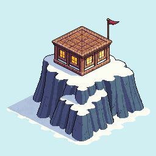 | 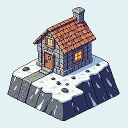 | 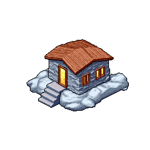 | 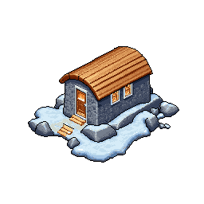 |

PixelLab followed more of the brief. Both attempts place a substantial stone
building on a snowy ridge, and the first reads as an observatory. Retro
Diffusion produced tidy cutouts, but both are small cabins on snow-covered
rocks. The observatory and mountain-ridge ideas mostly disappeared.

The trade-off is file readiness. Retro Diffusion removed the background and
used 35 and 36 colors. PixelLab returned opaque pale backgrounds and used 264
and 266 colors. PixelLab wins prompt coverage. Retro Diffusion needs less
cleanup before placement in a game map.

## River gate

Prompt: `a fortified village gate spanning a narrow river, three-quarter
top-down view, stone towers, timber bridge, isolated with no scenery`

| PixelLab A | PixelLab B | Retro Diffusion A | Retro Diffusion B |
|---|---|---|---|
| 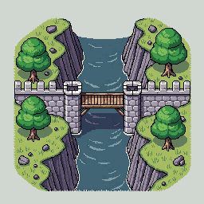 | 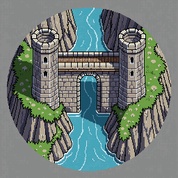 | 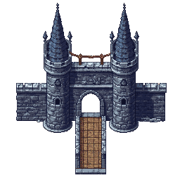 | 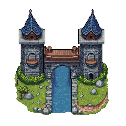 |

All four results are usable concepts. PixelLab shows more of the surrounding
riverbank and makes the bridge-water relationship obvious. Its outputs are
opaque scene patches. Retro Diffusion gives cleaner standalone fortifications.
Attempt B carries water through the gate; attempt A reads more like a drawbridge
than a river crossing.

PixelLab again follows the whole brief more reliably. Retro Diffusion is easier
to drop onto an existing map because its outputs have 56% to 64% transparent
pixels. The Retro Diffusion files also stay between 43 and 47 colors, compared
with PixelLab's 226 to 240.

## Alpine valley background

Prompt: `a wide alpine valley at dusk, layered mountains, pine forest, winding
river, small warm-lit village, full-bleed scenic background`

| PixelLab A | PixelLab B | Retro Diffusion A | Retro Diffusion B |
|---|---|---|---|
| 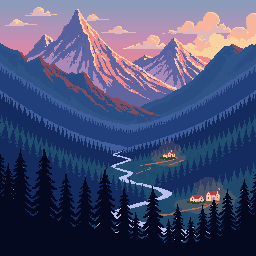 | 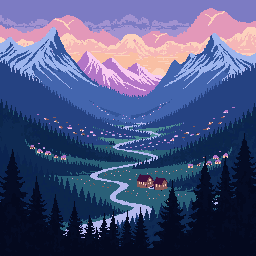 | 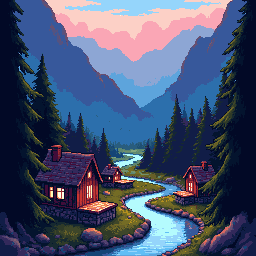 | 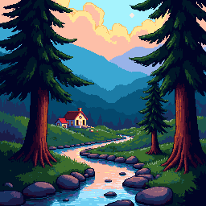 |

PixelLab's Pixflux route is the surprise here. Both results preserve the wide
valley, layered mountains, dusk light, winding river, and tiny settlement. They
also use only 22 and 38 colors. The shapes read cleanly at native size.

Retro Diffusion produced attractive scenes with stronger foreground framing
and more conventional depth. They feel like places the player could enter, but
the framing narrows the valley and pushes the result toward illustration rather
than a reusable background layer. They use 37 and 46 colors.

For this brief, PixelLab wins on prompt coverage, graphic clarity, consistency,
and cost. Retro Diffusion wins if the desired result is a closer, more cinematic
scene.

## Cliffside fortress at 384×384

Prompt: `a large fortified monastery built into a sheer mountain cliff,
isometric three-quarter view, central stone keep, two side towers, terraced
stairs, copper roofs, isolated with no scenery`

| PixelLab A | PixelLab B | Retro Diffusion A | Retro Diffusion B |
|---|---|---|---|
| 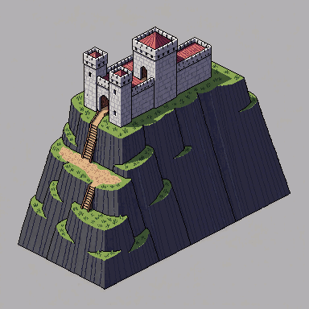 | 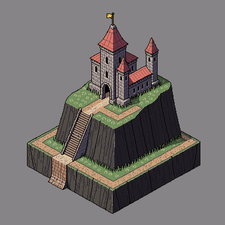 | 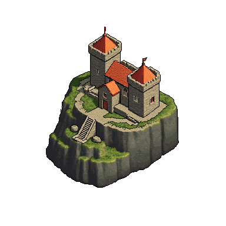 | 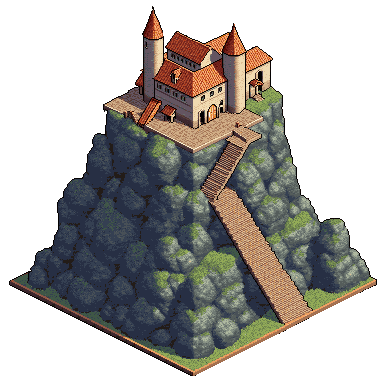 |

The larger canvas helped both providers. PixelLab used most of the frame and
kept the cliff, stairs, central keep, and tower structure legible. Attempt B is
the clearest match for a fortified monastery. Both outputs still include an
opaque gray field, and their 246 and 249 colors would need deliberate cleanup
for a tightly controlled palette.

Retro Diffusion improved markedly over its 256×256 observatory attempts. Both
results read as substantial cliffside compounds, and attempt B makes good use
of the full canvas. They are ready-to-place transparent cutouts with 75% and
52% transparent pixels and only 55 and 49 colors. PixelLab is more reliable on
the exact architectural brief. Retro Diffusion is closer to a finished modular
map asset.

## Volcanic pass at 384×384

Prompt: `a wide volcanic mountain pass at dawn, layered black peaks, glowing
lava river, basalt fortress in the middle distance, smoke plumes, full-bleed
parallax background with open sky`

| PixelLab A | PixelLab B | Retro Diffusion A | Retro Diffusion B |
|---|---|---|---|
| 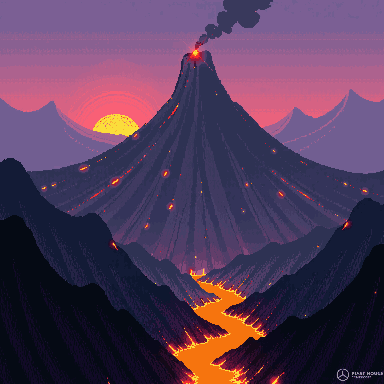 | 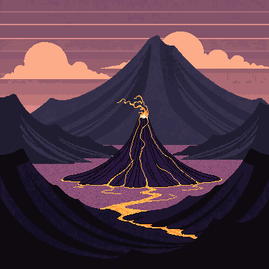 | 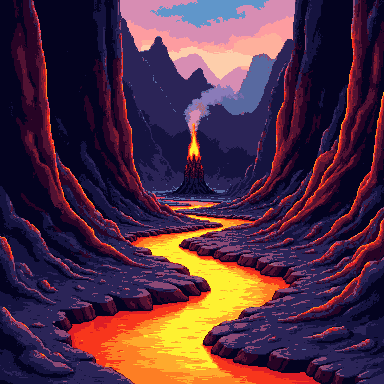 | 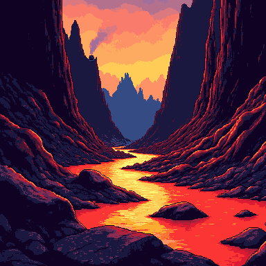 |

PixelLab produced broader compositions with open sky and visibly separated
mountain planes. Attempt A includes the smoke plume and a clear volcano; attempt
B simplifies the scene into a graphic basin. Neither attempt includes a
recognizable fortress. Attempt A also contains a generated signature-like mark
in the lower-right corner, so it is not usable without cleanup. The files use
44 and 26 colors.

Retro Diffusion made the pass and lava river unmistakable in both attempts. Its
narrow canyon framing is strong for a scene the player enters, but it leaves
less open sky and fewer obvious planes for a distant backdrop. It also dropped
the fortress and most of the smoke detail. The files use 26 and 25 colors.

None of these four files is a finished parallax package. They are flattened,
opaque scenes. PixelLab gives an artist clearer depth bands to cut apart; Retro
Diffusion gives the stronger single-frame canyon. A production workflow should
generate or extract the sky, distant peaks, middle ground, and foreground as
separate assets.

## ComfyUI SDXL extension

The local extension uses
[SDXL Base 1.0](https://huggingface.co/stabilityai/stable-diffusion-xl-base-1.0)
with [Pixel Art XL](https://huggingface.co/nerijs/pixel-art-xl). Both committed
workflows use core ComfyUI nodes, generate at 1024×1024, and finish with
`nearest-exact` reduction. There was no manual image edit or candidate choice.

| Mountain observatory, 256px | Cliffside fortress, 384px | Alpine valley, 256px | Volcanic pass, 384px |
|---|---|---|---|
| 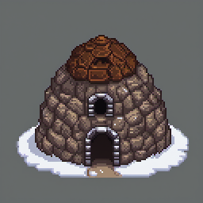 | 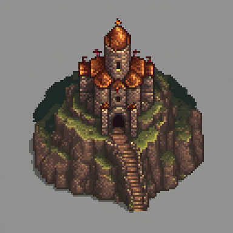 | 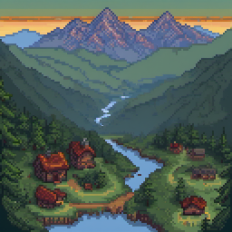 | 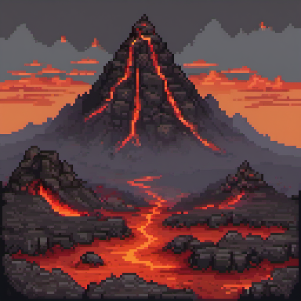 |

The observatory and fortress are the strongest architectural results in this
small sample. The fortress has a clear entrance, tower hierarchy, stairs, and a
single readable footprint. The alpine scene keeps the river, village, tree
line, and distant ridges separate. The volcanic scene is dramatic and legible,
but it drops the requested basalt fortress, the same prompt-coverage failure
seen in both hosted providers.

The trade-off is production cleanup. All four ComfyUI PNGs are opaque. The two
isolated files use 16,811 and 31,572 RGB colors, while the backgrounds use
36,248 and 50,985. They look pixelated because of the LoRA and nearest-exact
reduction, but they are not indexed, low-palette sprites. Add explicit
background removal and palette quantization when the target art direction
requires them.

### ComfyUI post-processing result

The follow-up graph keeps the generation settings fixed and changes only the
cleanup nodes. BiRefNet removes the isolated backgrounds, and ComfyUI's core
quantizer limits every image to 64 colors without dithering.

| Original observatory | Refined observatory | Original fortress | Refined fortress |
|---|---|---|---|
|  | 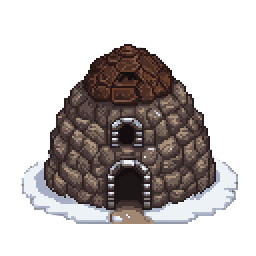 |  | 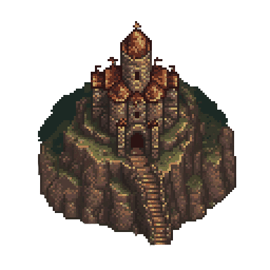 |

| Original alpine valley | 64-color alpine valley | Original volcanic pass | 64-color volcanic pass |
|---|---|---|---|
|  | 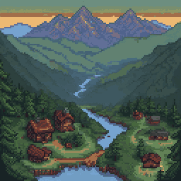 |  | 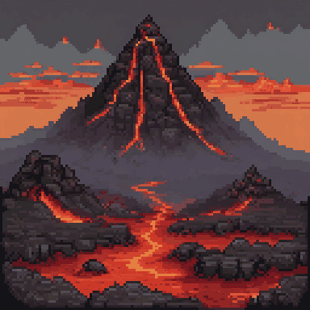 |

The cutouts retained their silhouettes while reaching 60% and 62% transparent
pixels. They use 55 and 58 RGB colors instead of 16,811 and 31,572. The scenic
images fell to 64 and 60 colors without losing their main depth bands. The
committed [post-processing project](../benchmarks/provider-postprocessing/comfyui/README.md)
contains the workflows, manifest, audit commands, and provenance.

### ComfyUI resolution result

A second benchmark keeps the alpine brief and seed fixed while separating the
model's generation canvas from the actual editable pixel grid.

| SDXL source | Recovered native art | Wide SDXL source | Recovered wide art |
|---|---|---|---|
| 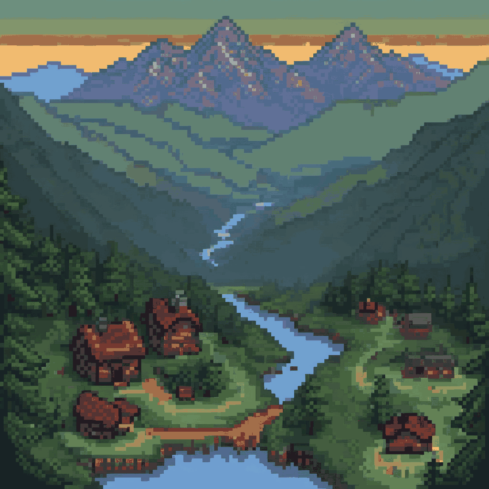 | 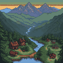 | 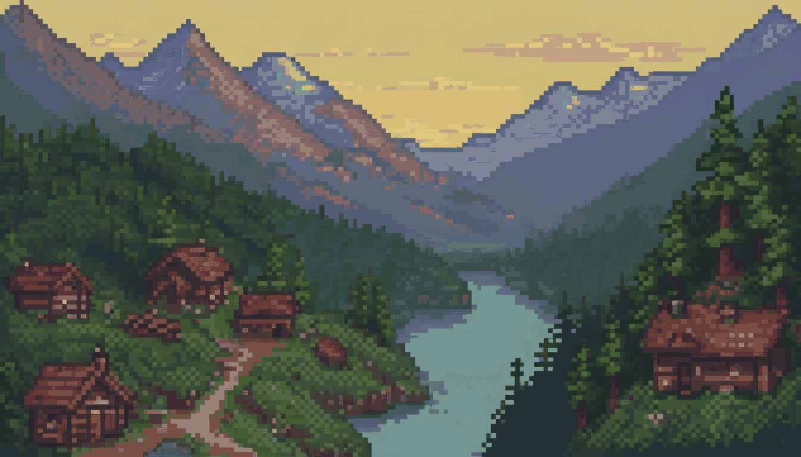 |  |

The 1024×1024 source carried an implied 8px cell and resolved to a 128×128
native grid. The 1344×768 source used the same cell step and resolved to 168×96.
Retro Diffusion Pixel Art Fixer reported high-confidence consensus for both.
The reconstructed outputs contain 48 colors and one stored pixel per recovered
cell.

This invalidated our earlier 2048px nearest-neighbor result. That file perfectly
duplicated the source raster, including its fake, softened cells. It was a larger
delivery file, not better pixel art, and has been removed from the showcase.

Earlier 1536px and 2048px latent refinements also looked blurred. The extra
interpolation and resampling softened the structure; color quantization could
not repair it. The committed
[resolution project](../benchmarks/provider-hires/comfyui/README.md) contains
the two provider workflows, source outputs, native reconstructions, fixer
report, audit instructions, and lock provenance.

## Cost and operational results

| Provider | Successful images | Charged amount | Final balance |
|---|---:|---:|---:|
| PixelLab | 10 | 10 generations | 4,411 generations |
| Retro Diffusion | 10 | $0.744 | $9.73 |
| ComfyUI | 10 | 0 `free` PixelKiln units | No account balance |

PixelLab charged one generation per image. Retro Diffusion quoted and charged
$0.058 for each 256px RD Plus image and $0.099 for each 384px RD Plus image;
PixelKiln's hard ceiling rounds the latter to $0.10 per image.

The run also caught two integration details:

- PixelLab's `map` endpoint rejected the literal `isometric` view. PixelKiln
  should document or validate the accepted values before submission.
- Retro Diffusion rounded its live quote up from PixelKiln's formula result of
  $0.057768 to $0.058. PixelKiln now rounds offline estimates up to the live
  quote precision, so planning remains a safe ceiling.

All three manifests now pass `doctor` and report a current plan. The hosted
projects have ten healthy PNG cache entries each; the ComfyUI projects have
four baseline, four cleanup, and two resolution-test entries. Three additional
native-grid PNGs are deterministic post-processing results, not provider jobs.

## Recommendation

For large isolated buildings or landmarks, start with PixelLab when prompt
coverage matters most. Budget for background cleanup. Start with Retro
Diffusion when a transparent, low-color asset matters more than capturing every
noun in a complex prompt. At 384×384, Retro Diffusion can fill the frame with a
substantial structure rather than the compact cutouts seen in the first brief.

For full scenic backgrounds, start with PixelLab Pixflux. These two attempts
were cheaper and more faithful to the brief. Try Retro Diffusion when you want
foreground framing and a closer illustrated scene.

Try the tested ComfyUI SDXL stack when local control and larger compositions
matter most. It produced the best large building in this run and a strong
layered valley, with no provider charge. The refined core-node graph also makes
transparent, 64-color cutouts. A one-pass 1024px render took roughly 60 to 90
seconds on the tested Apple MPS machine. Treat that output as a generation
canvas, then reconstruct and edit the actual native grid. The tested
latent-upscale passes blurred the art, while nearest-neighbor scaling merely
duplicated its pseudo-pixels.

Do not ask any provider for one giant finished level. Generate terrain,
background, buildings, landmarks, and foreground pieces separately. Normalize
them to one native grid, compose at 1×, then use integer nearest-neighbor scaling
for display.

This sample is useful, not definitive. Two attempts expose obvious tendencies,
but they do not measure every style, prompt family, or model update. The new
volcanic brief also shows why prompt coverage needs review at the object level:
all providers lost the requested fortress. Rerun the committed manifests when
a provider or local model changes.
